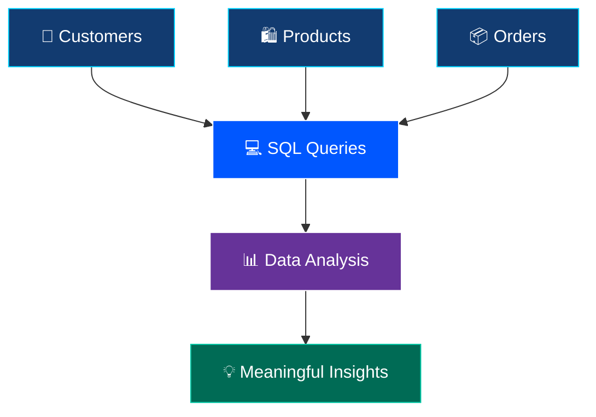

<div align="center">


<br>


<br><br>


<br><br>

### ✨ QUERY • ANALYZE • DISCOVER ✨

**Turning E-Commerce Data Into Meaningful Insights**

</div>

---

## 🌌 01. PROJECT OVERVIEW

<table>
<tr>
<td>

### 🚀 Welcome to SQL Data Analysis!

This project demonstrates the power of SQL in extracting, filtering, sorting, and analyzing information from an e-commerce database.

By working with customer, product, and order tables, this project builds practical database querying skills and introduces essential data analysis techniques.

**🎯 Mission:** Transform raw data into meaningful information using SQL.

</td>
</tr>
</table>

---

## 🎯 02. PROJECT OBJECTIVES

<table>
<tr>
<td align="center" width="33%">

### 🔍
### Data Retrieval

Retrieve records using `SELECT`.

</td>
<td align="center" width="33%">

### 🎯
### Data Filtering

Filter information using `WHERE`.

</td>
<td align="center" width="33%">

### 📊
### Data Analysis

Summarize information using SQL functions.

</td>
</tr>
<tr>
<td align="center">

### ↕️
### Data Sorting

Organize records using `ORDER BY`.

</td>
<td align="center">

### 🔗
### Table Joining

Combine related tables using `JOIN`.

</td>
<td align="center">

### 💡
### Business Insights

Explore useful information from data.

</td>
</tr>
</table>

---

## ⚡ 03. TECHNOLOGY STACK

<div align="center">


<br><br>


</div>

---

## 🗄️ 04. DATABASE STRUCTURE

<div align="center">

| 🧩 Database Table | 📝 Description |
|:---|:---|
| 👥 `customers` | Customer-related information |
| 🛍️ `products` | Product information |
| 📦 `orders` | Order-related records |

</div>

### 🔗 Data Analysis Workflow



---

## 💻 05. SQL QUERY LAB

### 🔹 Query 01 — Retrieve Customer Data

```sql
SELECT *
FROM customers;
```

**Purpose:** Retrieve customer records from the database.

### 🔹 Query 02 — Filter Products

```sql
SELECT *
FROM products
WHERE price > 100;
```

**Purpose:** Retrieve products priced above 100.

### 🔹 Query 03 — Sort Orders

```sql
SELECT *
FROM orders
ORDER BY order_date DESC;
```

**Purpose:** Sort orders by date, newest first.

### 🔹 Query 04 — Calculate Total Order Value

```sql
SELECT SUM(amount) AS total_order_value
FROM orders;
```

**Purpose:** Calculate the sum of order amounts.

> ⚠️ These are example queries. Ensure the column names match your actual database schema before running them.

---

## 🧠 06. SQL CONCEPTS MASTERED

<div align="center">

| SQL Concept | Application |
|:---|:---|
| `SELECT` | Retrieve records |
| `WHERE` | Filter records |
| `ORDER BY` | Sort query results |
| `GROUP BY` | Group records |
| `JOIN` | Combine related tables |
| `SUM()` | Calculate totals |
| `AVG()` | Calculate averages |
| `MIN()` | Find minimum values |
| `MAX()` | Find maximum values |

</div>

---

## 📂 07. PROJECT STRUCTURE

```text
📦 Task-3-SQL-Data-Analysis
 ┣ 📂 Dataset
 ┃ ┗ 📄 E-commerce dataset
 ┣ 📂 Queries
 ┃ ┗ 📄 SQL query files
 ┣ 📂 Screenshots
 ┃ ┗ 🖼️ Query execution results
 ┗ 📄 README.md
```

*Note: This is an illustrative structure. Adjust it to match the actual files in your repository.*

---

## 📸 08. PROJECT SCREENSHOTS

<div align="center">

### 🖥️ SQL Query Execution

Add screenshots of your actual queries and successful outputs below.

<br>

**Query Results Preview**

Replace this section with screenshots from your project.

</div>

---

## 🚀 09. HOW TO RUN THE PROJECT

**STEP 01** — Download or clone the repository.

**STEP 02** — Open the project in VS Code.

**STEP 03** — Open the SQLite database using a compatible database tool.

**STEP 04** — Load the SQL scripts included in the project.

**STEP 05** — Execute the queries.

**STEP 06** — Review the output and analyze the results.

---

## 🏆 10. KEY LEARNINGS

- 💎 Understanding SQL fundamentals.
- 🔍 Retrieving and filtering database records.
- 📊 Using aggregate functions for analysis.
- 🔗 Combining related tables using JOIN.
- 🧠 Building a foundation in data analytics.
- 🚀 Developing practical database querying skills.

---

## 🌟 11. PROJECT HIGHLIGHTS

<div align="center">

<table>
<tr>
<td align="center" width="33%">

### 🗄️
**Database Skills**

Practical SQL querying.

</td>
<td align="center" width="33%">

### 📈
**Analytical Thinking**

Understanding data patterns.

</td>
<td align="center" width="33%">

### 💻
**Hands-On Learning**

Working with e-commerce data.

</td>
</tr>
</table>

</div>

---

<div align="center">


## 👨‍💻 KEEP LEARNING. KEEP BUILDING. KEEP GROWING.

### 💙 Thank You for Visiting!


<br><br>

**⭐ If you find this project useful, consider starring the repository!**

<br>


</div>
